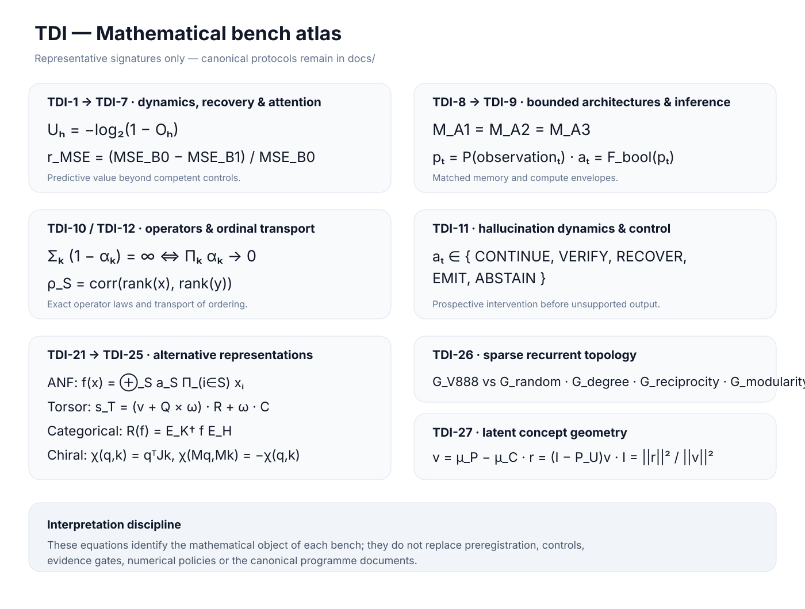

# TDI — Dynamic Information Theory

**TDI is a deterministic Rust research programme for testing which structural, dynamical and representational properties retain predictive information under controlled interventions.**

The repository is organized as falsifiable research benches. Each bench owns its controls, numerical policy, evidence boundary and reproducibility contract; positive, negative, equivalent and inconclusive outcomes are retained.

> **Execution:** [research engine guide](docs/engineering/research-engine.md)  
> **Scientific source of truth:** canonical programme, preregistration and status files under [`docs/`](docs/).

## Scientific workflow

```text
question → preregistration → deterministic semantics → Development / Validation
         → frozen evidence boundary → gated confirmation → retained evidence
```

TDI is fail-closed: controls precede confirmatory evidence, protected populations stay isolated, resource budgets are explicit, and numerical evidence is never promoted to proof.

## Research benches

| Research line | Scientific question | Programme |
| --- | --- | --- |
| **TDI-1 → TDI-7 — dynamics, recovery & attention** | Which intervention-conditioned recovery signals add predictive information beyond competent static controls? | [TDI-7](docs/TDI-7.0-ATTENTION-RECOVERY-PREREGISTRATION.md) |
| **TDI-8 → TDI-9 — bounded architectures & adaptive inference** | What is gained by recurrence, associative memory and adaptive compute under explicit matched budgets? | [TDI-8](docs/TDI-8-PROGRAMME.md) · [TDI-9](docs/TDI-9-PROGRAMME.md) |
| **TDI-10 / TDI-12 — operators & ordinal transport** | Which operator identities are exact, and when does ordering transport more robustly than calibration? | [TDI-10](docs/TDI-10-PROGRAMME.md) · [TDI-12](docs/TDI-12-PROGRAMME.md) |
| **TDI-11 — hallucination dynamics & control** | Can prospective trajectory signals trigger bounded verification, recovery or abstention before unsupported output? | [TDI-11](docs/TDI-11-PROGRAMME.md) |
| **TDI-21 → TDI-25 — alternative representation systems** | Can alternative representations reproduce useful structure while preserving explicit semantics and budgets? | [TDI-21](docs/TDI-21-PROGRAMME.md) · [TDI-22](docs/TDI-22-PROGRAMME.md) · [TDI-23](docs/TDI-23-PROGRAMME.md) · [TDI-24](docs/TDI-24-PROGRAMME.md) · [TDI-25](docs/TDI-25-PROGRAMME.md) |
| **TDI-26 — sparse recurrent topology** | Does V888-derived sparse structure add value beyond progressively stronger matched graph controls? | [TDI-26](docs/V888_CONNECTOME_BOOTSTRAP.md) |
| **TDI-27 — latent concept geometry** | After removing declared subspaces, is residual latent innovation stable, causal and sequentially independent? | [TDI-27](docs/TDI-27-PROGRAMME.md) |

## Mathematical atlas

<p align="center">
  
</p>

The atlas is intentionally renderer-safe: the formulas are embedded in a fixed SVG rather than evaluated by GitHub's MathJax subset. Canonical programme files and evaluators remain authoritative.

## Current frontier

The active `main` line is advancing **TDI-27.1 resampling and null calibration** on the latent concept-geometry bench. Development remains synthetic and bounded; confirmatory/final TDI-27 execution is not authorised by ordinary development work.

Parallel active lines include matched representation campaigns (TDI-24/TDI-25), sparse recurrent topology (TDI-26), and the established attention, memory, inference, operator and formal-representation programmes.

## Repository map

| Path | Purpose |
| --- | --- |
| [`tdi-core/`](tdi-core/) | exact finite-state and structural primitives |
| [`tdi-ai/`](tdi-ai/) | attention, memory, adaptive inference and experimental architecture primitives |
| [`tdi-operator/`](tdi-operator/) | operator, resolvent, Green-function and ordinal primitives |
| [`tdi-bench/`](tdi-bench/) | deterministic evaluators and executable research benches |
| [`docs/`](docs/) | programmes, preregistrations, audits and status records |
| [`results/`](results/) | retained evidence artefacts |
| [`scripts/`](scripts/) | integrity, reproduction and bounded research workflows |

## Reproduce the development surface

```bash
cargo fmt --all -- --check
cargo test --workspace
cargo clippy --workspace --all-targets -- -D warnings
```

Individual benches may add frozen manifests, confirmation guards or dedicated replay scripts. Those controls are part of the protocol and must not be bypassed.

For the current TDI-27 Development bench:

```bash
bash scripts/check-tdi27-bootstrap.sh
cargo run --locked -p tdi-bench --bin tdi27_concept_geometry
```

## Evidence boundary

TDI does **not** claim a universal law of intelligence, universal architecture superiority, guaranteed hardware speedups, proprietary-model reverse engineering, or a universal solution to hallucination. A result supports only the bounded claim tested by its declared protocol.

Promotion into SciRust, Forge, NNIS, ElasticXxx, FLAT-ATTENTION or another Memorithm project requires a separate scientific or engineering contract.

## License

TDI is **dual-licensed**; see [`LICENSING.md`](LICENSING.md).

- Noncommercial and personal use: [PolyForm Noncommercial License 1.0.0](LICENSE.md).
- Commercial use: separate commercial licence from the copyright holder.

Copyright 2026 Tarek Zekriti.
