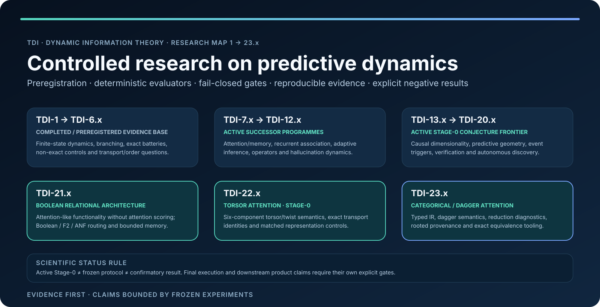

<p align="center">
  
</p>

# TDI — Dynamic Information Theory

**A deterministic Rust research programme studying which structural and dynamical descriptions of a system retain predictive information beyond simple scalar summaries.**

TDI develops falsifiable experiments, preregistered decision rules, deterministic evaluators and reproducible evidence. The programme started with exact finite-state dynamics and has expanded into attention / memory, bounded recurrent-associative architectures, adaptive inference dynamics, generic operator / resolvent research, and hallucination dynamics / control.

> The illustration above is a visual introduction. The status table below is the authoritative research map for the repository.

## Why TDI matters

TDI is not a collection of benchmark claims. It is a sequence of controlled research programmes designed to answer narrower questions with stronger evidence.

The project has already established a useful pattern: simple summaries can miss predictive structure, stronger controls can absorb apparent effects, transfer can preserve ordering while losing calibration, and a failed preregistered criterion can still reveal a concrete mechanism worth testing next. Positive, negative, equivalent and inconclusive outcomes are all retained.

The result is a growing body of **code + preregistration + evaluator + provenance + result artefacts**, rather than a narrative reconstructed after the experiment.

## Research map at a glance

| Series | Research line | Repository status | What it contributes |
| --- | --- | --- | --- |
| **TDI-1** | **Deterministic systems** | ✅ Completed | Shows that equal Shannon block entropy need not imply equal perturbation recovery, while also showing that the tested TDI-1 signal is subsumed by a stronger orbital baseline. |
| **TDI-2** | **Branching systems** | ✅ Completed | Preregistered continuous branching evaluation; predictive signal is measurable, but universal cross-width calibration is not established. |
| **TDI-3** | **Inter-width evaluation** | ✅ Completed | The preregistered inter-width criteria fail; the experiment isolates a width-sensitive signal rather than a universal representation. |
| **TDI-4** | **Target geometry** | ✅ Completed | The preregistered two-head protocol fails formally, while the continuous deficit geometry remains strongly informative in the tested regime. |
| **TDI-5.x** | **Exact confirmatory battery** | ✅ Completed line | Exact-rational, SHA-frozen, confirmation-gated experiments covering overlap ablation, nonlinear sufficiency, spectral controls, generator robustness and cross-width behaviour. |
| **TDI-6.1–6.7** | **Non-exact frontier** | ✅ Completed line | Extends the controls to literal spectral gap, nonlinear models, information decomposition, causal probes and cross-generator transfer diagnostics under declared floating-point discipline. |
| **TDI-6.8** | **Transportable Ordering Across Generator Families** | 🟠 Preregistered / research line | Tests whether rank ordering — rather than absolute calibration — transports across fresh generator-family populations under a frozen per-block criterion. |
| **TDI-7.x** | **Attention / Memory research programme** | 🟠 Active | Moves the intervention-conditioned recovery question into deterministic attention / memory tasks, then studies heterogeneity, long-horizon joint information and successor semantic questions. |
| **TDI-8.x** | **Recurrent Associative Architecture Research Programme** | 🟠 Active | Matched-budget A0/A1/A2/A3 programme comparing full-history reference, bounded recurrent state, associative memory, and a bounded VSA / holographic workspace. |
| **TDI-9.x** | **Autonomous Adaptive Inference Dynamics Research Programme** | 🟠 Active | C0/C1/C2/C3 policy ladder: fixed compute, static preallocation, adaptive stopping, then explicit verification / recovery under a declared compute envelope. |
| **TDI-10.x** | **Operator / Resolvent Research** | 🟠 Active | Generic Jacobi / tridiagonal operator work on shifted resolvents, Schur cavities, Green functions, finite transport and explicitly classified asymptotic claims. |
| **TDI-11.x** | **Hallucination Dynamics & Control Research Programme** | 🟠 Active bootstrap | Studies supported vs unsupported generation in fully specified worlds, measurable precursors, causal perturbations, risk estimation and bounded adaptive verification / recovery / abstention. |

## Current research frontier

The repository no longer stops at TDI-6.x.

### TDI-7.x — Attention / Memory

The programme begins with [`TDI-7.0 — Attention recovery preregistration`](docs/TDI-7.0-ATTENTION-RECOVERY-PREREGISTRATION.md): deterministic associative-recall and copy tasks test whether early intervention-conditioned recovery descriptors predict later retrieval deficit beyond competent static attention diagnostics.

Later TDI-7 work must preserve the distinction between a **confirmatory result**, a **frozen protocol**, an **identifiability blocker**, and an **unauthorised final holdout**. In particular, the current TDI-7.4 identifiability finding is a blocker for the present H-AI-3 realisation, not a confirmatory negative result.

### TDI-8.x — Recurrent Associative Architecture Research Programme

[`TDI-8.x`](docs/TDI-8-PROGRAMME.md) is the bounded alternative recurrent / associative architecture line.

- **A0** — competent attention-like full-history reference;
- **A1** — bounded recurrent-state-only reference;
- **A2** — A1 + explicit bounded associative memory (working label: ASSR);
- **A3** — A2 + bounded VSA / holographic workspace paid from the same dynamic-memory budget (working label: ASSR-H).

TDI-8.0 is frozen. TDI-8.1 builds the deterministic evaluator. TDI-8.2 remains a future human-only confirmatory holdout and is not authorised by ordinary development or CI.

### TDI-9.x — Autonomous Adaptive Inference Dynamics Research Programme

[`TDI-9.x`](docs/TDI-9-PROGRAMME.md) studies how much computation to spend and when to continue, stop, verify or recover.

Its policy ladder deliberately separates **fixed compute**, **static preallocation**, **adaptive stopping**, and **adaptive verification / recovery**. The final confirmation design uses a frozen derivation from future public entropy rather than a discretionary post-hoc seed choice.

### TDI-10.x — Operator / Resolvent Research

[`TDI-10.x`](docs/TDI-10-PROGRAMME.md) is a scientifically autonomous generic operator line for real symmetric tridiagonal / Jacobi operators.

The latest `main` state includes TDI-10.5 (**REFUTED** pointwise-subunit decay), TDI-10.6 (**EXACT** uniform geometric bound), and TDI-10.7 (**EXACT** divergent-remainder decay lemma). TDI-10 explicitly labels its evidence as **EXACT**, **PROVED UNDER DECLARED ASSUMPTIONS**, **FORMAL ASYMPTOTIC**, **NUMERICAL EVIDENCE**, **CONJECTURE**, or **REFUTED**. Numerical evidence is never silently promoted to proof.

### TDI-11.x — Hallucination Dynamics & Control Research Programme

[`TDI-11.x`](docs/TDI-11-PROGRAMME.md) studies hallucination as an inference phenomenon rather than only as a benchmark score. The programme begins from fully specified deterministic worlds so the evaluator can separate facts explicitly available to a model, facts derivable from those inputs, hidden-but-true facts, contradictions, nonexistent entities and genuinely unsupported assertions.

TDI-11 deliberately separates **detection**, **localization**, **diagnosis**, **intervention** and **decision**. Its working controller label is **HAC — Hallucination Adaptive Controller**, with candidate bounded actions such as `CONTINUE`, `VERIFY`, `BACKTRACK`, `RECOVER`, `EMIT` and `ABSTAIN`. HAC is a working label, not a novelty or universality claim.

TDI-11.0 is an active bootstrap/scope stage and is **not frozen**. TDI-11.1 evaluator implementation is not authorised until an explicit preregistration and implementation gate freeze the taxonomy, controlled-world oracle, allowed observables, interventions, resource accounting, split discipline, metrics and provenance rules. See [`TDI-11.0 — Hallucination Dynamics Scope and Stage Gate`](docs/TDI-11.0-HALLUCINATION-DYNAMICS-SCOPE.md).

## What the completed programme has taught us

Across the historical finite-state campaign, the strongest supported conclusion is deliberately narrower than a grand theory claim.

Within the tested synthetic branching families, early intervention-conditioned distribution overlap contains predictive information beyond entropy/topology controls, exact contraction descriptors, exact spectral moments, the literal spectral gap, ε-mixing time, and the tested degree-2 interaction model. The effect replicates across multiple generator families and widths.

At the same time, **transportable calibration fails** across widths and generators, effect size is not universal, and two label-free calibration repairs were refuted. This is not hidden as a weakness: it is part of the scientific result and directly motivates the transport/order and successor programmes.

## Evidence discipline

TDI uses a fail-closed research workflow:

1. **Preregister** the question, controls, split discipline, metric and decision rule.
2. **Freeze** the scientific artefacts and their hashes before confirmatory evidence.
3. **Implement** deterministic reference semantics and bounded validation tests.
4. **Keep final material isolated** from ordinary development surfaces.
5. **Execute once under the declared gate** when a final run is authorised.
6. **Publish the result even when it fails**, including provenance, limitations and counterexamples.

TDI-5.x uses exact-rational, bit-reproducible computation. TDI-6.x and later non-exact work must declare numerical policies and evidence boundaries explicitly.

## Explore the evidence

- [`docs/`](docs/) — preregistrations, scientific reports, status documents, audits and limitations.
- [`results/`](results/) — captured deterministic reference outputs and result artefacts.
- [`scripts/`](scripts/) — reproduction commands and integrity checks.
- [`tdi-core/`](tdi-core/) — finite-state dynamics and structural primitives.
- [`tdi-bench/`](tdi-bench/) — evaluators, scans, models and deterministic statistical procedures.
- [`tdi-operator/`](tdi-operator/) — generic operator / resolvent primitives for the TDI-10 line.

## Reproducibility

Standard development validation:

```bash
cargo fmt --all -- --check
cargo test --workspace
cargo clippy --workspace --all-targets -- -D warnings
```

Confirmatory experiments may impose additional frozen scripts, manifests, exact tokens or future-entropy rules. Those gates are part of the scientific protocol and must not be bypassed by CI or development automation.

## Non-claims

TDI does **not** claim a universal law of intelligence, AGI, a world model, proprietary-model reverse engineering, universal asymptotic superiority, guaranteed hardware speedups, or a universal solution to hallucination.

Each result supports only the bounded claim that its frozen experiment actually tests. Promotion into SciRust, Forge, NNIS, ElasticXxx, FLAT-ATTENTION or another Memorithm project requires a separate engineering or scientific contract.

## License

TDI is **dual-licensed**; see [`LICENSING.md`](LICENSING.md).

- Noncommercial and personal use: [PolyForm Noncommercial License 1.0.0](LICENSE.md).
- Commercial use: separate commercial licence from the copyright holder.

Copyright 2026 Tarek Zekriti.
