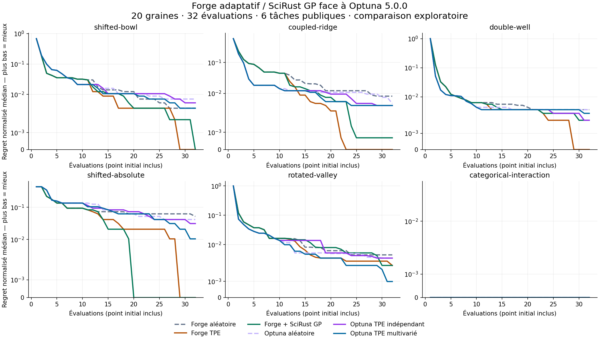

# Forge adaptive comparison — public Development, 2026-09-18

Complete run: **720 task/seed/arm runs, 23,040 evaluations**, no runs omitted. Protocol and implementation were published before the run. Each arm has the same 32-evaluation budget, baseline and categorical space; 20 seeds per task.

## Median final regret

Lower is better; final best loss minus the exact finite-grid minimum. These are descriptive medians on fixed public tasks, not confidence intervals or independent confirmation.

| Task | Forge aléatoire | Forge TPE | Forge + SciRust GP | Optuna aléatoire | Optuna TPE indépendant | Optuna TPE multivarié |
| --- | ---: | ---: | ---: | ---: | ---: | ---: |
| shifted-bowl | 1 | 0 | 0 | 2 | 1.5 | 1 |
| coupled-ridge | 6 | 0 | 0.5 | 3.5 | 3 | 3 |
| double-well | 24 | 0 | 12 | 24 | 12 | 18 |
| shifted-absolute | 2.5 | 0 | 0 | 2 | 1.5 | 0.5 |
| rotated-valley | 9 | 4 | 4 | 7 | 7 | 2 |
| categorical-interaction | 0 | 0 | 0 | 0 | 0 | 0 |



The vertical scale is symmetric-logarithmic (linear below normalized regret 0.002). Baseline counts as evaluation 1. No rank or timing advantage is inferred from the plotting scale.

On the five discriminating tasks, each adaptive Forge policy has lower median
final regret than multivariate Optuna TPE on four tasks; Optuna wins on
`rotated-valley`. Forge TPE reaches zero median final regret on four tasks;
this does not mean every seed reaches the optimum. The GP improves over Forge
random on all five tasks, but is not consistently better than native Forge TPE.

The trajectory metric gives a different picture: both adaptive Forge policies
have lower median normalized AUC than multivariate Optuna on only two of five
tasks. Optuna's stronger early progress on the other tasks is retained below.
These are taskwise descriptive observations, not statistical superiority.

## Median normalized area under incumbent regret

Includes all evaluations, including the common initial baseline; lower is better.

| Task | Forge aléatoire | Forge TPE | Forge + SciRust GP | Optuna aléatoire | Optuna TPE indépendant | Optuna TPE multivarié |
| --- | ---: | ---: | ---: | ---: | ---: | ---: |
| shifted-bowl | 0.052341 | 0.043452 | 0.043562 | 0.049083 | 0.049967 | 0.051292 |
| coupled-ridge | 0.054922 | 0.047793 | 0.048092 | 0.040365 | 0.039532 | 0.041026 |
| double-well | 0.043417 | 0.042181 | 0.042898 | 0.040336 | 0.039591 | 0.040148 |
| shifted-absolute | 0.110026 | 0.088216 | 0.071615 | 0.116536 | 0.113281 | 0.111654 |
| rotated-valley | 0.051883 | 0.051458 | 0.052554 | 0.047909 | 0.048758 | 0.047647 |
| categorical-interaction | 0.000000 | 0.000000 | 0.000000 | 0.000000 | 0.000000 | 0.000000 |

## Observed adapter cost

These are median elapsed seconds per 32-evaluation arm, across all 120 task/seed cases. They include proposal control, verification, evaluation, replay and durable IO. Different architectures and a shared host preclude intrinsic optimizer-speed claims.

| Arm | Median observed seconds |
| --- | ---: |
| Forge aléatoire | 2.403 |
| Forge TPE | 2.716 |
| Forge + SciRust GP | 2.829 |
| Optuna aléatoire | 0.017 |
| Optuna TPE indépendant | 0.031 |
| Optuna TPE multivarié | 0.028 |

## Scope and evidence

- Protocol-design limitation discovered during execution: the categorical-interaction baseline already attains the exact minimum (0). All arms therefore have zero incumbent regret on that task. It is retained, not replaced or presented as discriminating evidence; only five tasks can distinguish final search quality.
- This extends the three known public tasks with three other public tasks. The earlier results were known during development. Constants/tasks/seeds were not retuned or dropped after this execution. No independent/general superiority claim.
- Forge never repeats a point; Optuna may repeat points. Every repeated evaluation is charged. No cache, pruning or concurrency. No numeric geometry is inferred from category labels.
- GP fitting uses the actual pinned SciRust crate. Forge owns kernel and acquisition. GP uncertainty is a search heuristic, not scientific confidence.
- Timings include unequal adapter architecture (Forge subprocess and checkpoint replay versus Optuna in-process); they do not establish intrinsic optimizer speed.
- No model, GPU, Hub worker, protected/final stage or production route was executed.
- TDI executed revision: `ac1fcdafddbe8ff3de96fd09a3aa3ddb61d9cff5`.
- Forge executed source declaration: `e23f945d4f8bcc283f09826f513f208836efc1c4`.
- SciRust numerical dependency: `146575107005c24a47682dcaa08c4cd9464d1cc3`.
- Forge binary SHA-256: `e0aa3a2a51d22d6475a87b660f5aa277efb4b5bbc347ca6db99057505b2d483c`.
- Report identity: `0395d4a740d9c9d1435676de130d9eceb053c982231a049060bfad0ad53b6e62`.
- Raw file SHA-256: `dc096b8a2b5aa154e234c976d80c3cfb9a9b2c4832effc65fcc858d5a9c2bb6a`.
- [Complete raw report](2026-09-18-forge-adaptive-development.json.gz) includes all trajectories, source/package/environment records and summaries.
- All 180 overlapping historical task/seed/arm trajectories (parameters, losses and incumbents) match the previous report exactly.
- Source declarations are not build attestations. Later CI-only/style fixes are not silently attributed to this run.

From the recorded TDI revision, after installing its pinned Optuna environment:

```bash
gzip -dk 2026-09-18-forge-adaptive-development.json.gz
python scripts/tdi_optuna_benchmark.py --verify-report 2026-09-18-forge-adaptive-development.json
```
