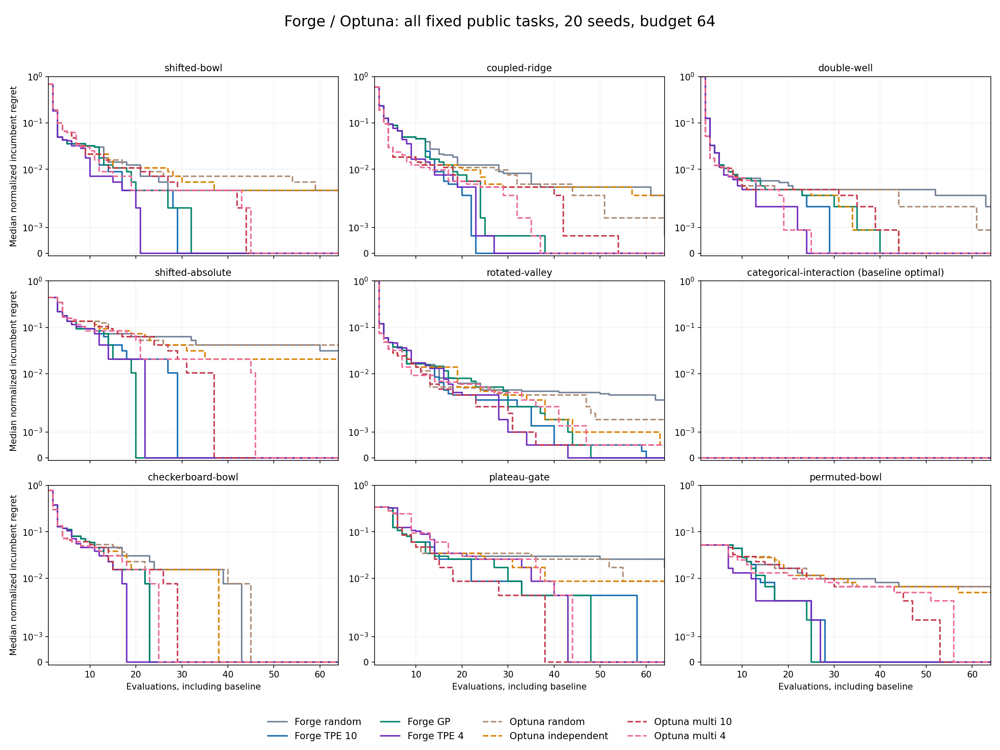

# Forge sessions and early TPE — executed Development evidence, 2026-09-18

The persistent adapter is **18.147× faster for TPE and 20.639× faster for GP** in the median of paired replay/session ratios on this host. All 60 paired parameter/loss/incumbent trajectories match exactly. This is a transport improvement, not an intrinsic speed comparison with Optuna.

All three qualified campaigns completed: **3,000 runs and 142,080 evaluations**. Quality covers nine public categorical tasks, twenty fixed seeds, eight arms and budgets of 32 and 64 evaluations including the common baseline. Eight tasks discriminate search quality; categorical-interaction starts at its optimum and is retained but excluded from win/tie/loss counts.

The early TPE is an opt-in, separately versioned candidate; these outcomes do not promote it to a default. No single policy is selected retrospectively for each task. Tables include every arm and every task, including unfavorable cases.

## Paired transport

| Strategy | Replay median seconds | Session median seconds | Median paired ratio | Pairs |
| --- | --- | --- | --- | --- |
| TPE | 2.221679 | 0.123726 | 18.147 | 30 |
| GP | 2.421564 | 0.115729 | 20.639 | 30 |

Each case performs 32 evaluations. Replay also receives the shared pidfd completion improvement, so these ratios isolate the measured adapter transition to persistent sessions against an already improved replay path. Ratio-of-medians and median-of-ratios are different statistics; the reported speed factors use the latter.

## Quality: task-level comparisons

Cells are **lower / equal / higher** task medians (eight informative tasks); lower is better. These are descriptive counts, not statistical significance, independent task-population inference, or universal superiority. All alternatives were fixed before execution; the equally early Optuna comparator is retained.

| Budget | Forge | Comparator | Final regret | Incumbent AUC |
| --- | --- | --- | --- | --- |
| 32 | Forge TPE 10 | Optuna multi 10 | 5/1/2 | 3/0/5 |
| 32 | Forge TPE 10 | Optuna multi 4 | 6/2/0 | 4/0/4 |
| 32 | Forge GP | Optuna multi 10 | 5/1/2 | 4/0/4 |
| 32 | Forge GP | Optuna multi 4 | 6/1/1 | 4/0/4 |
| 32 | Forge TPE 4 | Optuna multi 10 | 5/2/1 | 4/0/4 |
| 32 | Forge TPE 4 | Optuna multi 4 | 5/3/0 | 4/0/4 |
| 64 | Forge TPE 10 | Optuna multi 10 | 1/7/0 | 3/0/5 |
| 64 | Forge TPE 10 | Optuna multi 4 | 1/7/0 | 4/0/4 |
| 64 | Forge GP | Optuna multi 10 | 1/7/0 | 3/0/5 |
| 64 | Forge GP | Optuna multi 4 | 1/7/0 | 4/0/4 |
| 64 | Forge TPE 4 | Optuna multi 10 | 1/7/0 | 4/0/4 |
| 64 | Forge TPE 4 | Optuna multi 4 | 1/7/0 | 4/0/4 |

The early-start change improves some tasks and harms others. Its comparison with original Forge TPE is reported independently of the Optuna contrasts:

| Budget | Early vs original: final regret | Early vs original: AUC |
| --- | --- | --- |
| 32 | 1/6/1 | 6/0/2 |
| 64 | 0/8/0 | 5/0/3 |

## Budget 32: all task medians

Final regret is best observed loss minus the exact finite-grid minimum; zero is optimal.

| Task | Forge random | Forge TPE 10 | Forge GP | Forge TPE 4 | Optuna random | Optuna independent | Optuna multi 10 | Optuna multi 4 |
| --- | --- | --- | --- | --- | --- | --- | --- | --- |
| shifted-bowl | 1 | 0 | 0 | 0 | 2 | 1.5 | 1 | 1 |
| coupled-ridge | 6 | 0 | 0.5 | 0 | 3.5 | 3 | 3 | 1 |
| double-well | 24 | 0 | 12 | 0 | 24 | 12 | 18 | 0 |
| shifted-absolute | 2.5 | 0 | 0 | 0 | 2 | 1.5 | 0.5 | 1 |
| rotated-valley | 9 | 4 | 4 | 2 | 7 | 7 | 2 | 8 |
| categorical-interaction | 0 | 0 | 0 | 0 | 0 | 0 | 0 | 0 |
| checkerboard-bowl | 4 | 0 | 0 | 0 | 4 | 4 | 0 | 0 |
| plateau-gate | 3.5 | 1 | 1 | 3 | 4 | 2 | 0.5 | 3 |
| permuted-bowl | 3 | 0 | 0 | 0 | 2.5 | 3 | 2 | 2 |

Incumbent AUC is the mean regret across all evaluations, divided by the exact grid loss range. It includes the common baseline and measures the complete learning trajectory; it is not simply the final quality.

| Task | Forge random | Forge TPE 10 | Forge GP | Forge TPE 4 | Optuna random | Optuna independent | Optuna multi 10 | Optuna multi 4 |
| --- | --- | --- | --- | --- | --- | --- | --- | --- |
| shifted-bowl | 0.052341 | 0.043452 | 0.043562 | 0.042900 | 0.049083 | 0.049967 | 0.051292 | 0.049360 |
| coupled-ridge | 0.054922 | 0.047793 | 0.048092 | 0.047643 | 0.040365 | 0.039532 | 0.041026 | 0.039340 |
| double-well | 0.043417 | 0.042181 | 0.042898 | 0.042138 | 0.040336 | 0.039591 | 0.040148 | 0.039846 |
| shifted-absolute | 0.110026 | 0.088216 | 0.071615 | 0.074870 | 0.116536 | 0.113281 | 0.111654 | 0.105143 |
| rotated-valley | 0.051883 | 0.051458 | 0.052554 | 0.053480 | 0.047909 | 0.048758 | 0.047647 | 0.047577 |
| categorical-interaction | 0.000000 | 0.000000 | 0.000000 | 0.000000 | 0.000000 | 0.000000 | 0.000000 | 0.000000 |
| checkerboard-bowl | 0.090757 | 0.073515 | 0.073096 | 0.062500 | 0.079861 | 0.072557 | 0.066930 | 0.070223 |
| plateau-gate | 0.081864 | 0.078659 | 0.074653 | 0.099893 | 0.080262 | 0.081464 | 0.076656 | 0.098691 |
| permuted-bowl | 0.023182 | 0.018842 | 0.018178 | 0.013327 | 0.029412 | 0.024408 | 0.027369 | 0.019761 |

Observed timing covers initialization, proposal, verification, objective, durable writes and shutdown. Medians below pool all 180 task/seed runs per arm; optimum counts exclude the noninformative task (160 cases).

| Arm | Median milliseconds/run | Median unique points | Optimum cases / 160 |
| --- | --- | --- | --- |
| Forge random | 119.270 | 32 | 24 |
| Forge TPE 10 | 121.000 | 32 | 93 |
| Forge GP | 123.076 | 32 | 86 |
| Forge TPE 4 | 121.528 | 32 | 96 |
| Optuna random | 25.541 | 30.5 | 29 |
| Optuna independent | 39.913 | 23 | 40 |
| Optuna multi 10 | 37.244 | 26 | 57 |
| Optuna multi 4 | 39.146 | 26 | 56 |

## Budget 64: all task medians

Final regret is best observed loss minus the exact finite-grid minimum; zero is optimal.

| Task | Forge random | Forge TPE 10 | Forge GP | Forge TPE 4 | Optuna random | Optuna independent | Optuna multi 10 | Optuna multi 4 |
| --- | --- | --- | --- | --- | --- | --- | --- | --- |
| shifted-bowl | 1 | 0 | 0 | 0 | 1 | 1 | 0 | 0 |
| coupled-ridge | 0.5 | 0 | 0 | 0 | 1 | 2 | 0 | 0 |
| double-well | 12 | 0 | 0 | 0 | 6 | 0 | 0 | 0 |
| shifted-absolute | 1.5 | 0 | 0 | 0 | 2 | 1 | 0 | 0 |
| rotated-valley | 5.5 | 0 | 0 | 0 | 3 | 1 | 1 | 1 |
| categorical-interaction | 0 | 0 | 0 | 0 | 0 | 0 | 0 | 0 |
| checkerboard-bowl | 0 | 0 | 0 | 0 | 0 | 0 | 0 | 0 |
| plateau-gate | 2 | 0 | 0 | 0 | 1 | 1 | 0 | 0 |
| permuted-bowl | 2 | 0 | 0 | 0 | 2 | 1.5 | 0 | 0 |

Incumbent AUC is the mean regret across all evaluations, divided by the exact grid loss range. It includes the common baseline and measures the complete learning trajectory; it is not simply the final quality.

| Task | Forge random | Forge TPE 10 | Forge GP | Forge TPE 4 | Optuna random | Optuna independent | Optuna multi 10 | Optuna multi 4 |
| --- | --- | --- | --- | --- | --- | --- | --- | --- |
| shifted-bowl | 0.027965 | 0.022085 | 0.022692 | 0.022416 | 0.028048 | 0.026695 | 0.025646 | 0.025894 |
| coupled-ridge | 0.029596 | 0.024121 | 0.024953 | 0.023822 | 0.023363 | 0.023726 | 0.022093 | 0.020204 |
| double-well | 0.023466 | 0.021331 | 0.022485 | 0.021069 | 0.021414 | 0.020968 | 0.020560 | 0.020307 |
| shifted-absolute | 0.074219 | 0.046061 | 0.037272 | 0.039714 | 0.078613 | 0.068034 | 0.058757 | 0.061523 |
| rotated-valley | 0.028117 | 0.026551 | 0.026362 | 0.027299 | 0.025421 | 0.026073 | 0.024626 | 0.025015 |
| categorical-interaction | 0.000000 | 0.000000 | 0.000000 | 0.000000 | 0.000000 | 0.000000 | 0.000000 | 0.000000 |
| checkerboard-bowl | 0.050946 | 0.037566 | 0.036668 | 0.031250 | 0.042924 | 0.040439 | 0.034034 | 0.035620 |
| plateau-gate | 0.054153 | 0.045873 | 0.043937 | 0.053486 | 0.051015 | 0.052150 | 0.042268 | 0.050548 |
| permuted-bowl | 0.015625 | 0.009676 | 0.009089 | 0.006664 | 0.018740 | 0.015472 | 0.015395 | 0.012766 |

Observed timing covers initialization, proposal, verification, objective, durable writes and shutdown. Medians below pool all 180 task/seed runs per arm; optimum counts exclude the noninformative task (160 cases).

| Arm | Median milliseconds/run | Median unique points | Optimum cases / 160 |
| --- | --- | --- | --- |
| Forge random | 175.032 | 64 | 45 |
| Forge TPE 10 | 185.897 | 64 | 142 |
| Forge GP | 198.461 | 64 | 138 |
| Forge TPE 4 | 184.868 | 64 | 144 |
| Optuna random | 32.995 | 56.5 | 48 |
| Optuna independent | 72.435 | 40 | 74 |
| Optuna multi 10 | 62.457 | 49.5 | 125 |
| Optuna multi 4 | 65.486 | 50 | 127 |

## Complete learning curves at budget 64



Each curve is the pointwise median over twenty runs; it is not a single run or a confidence interval. The vertical scale is symmetric-log with a linear region near zero. Every arm and task is plotted, including the nondiscriminating zero panel.

## Reproducibility and preserved earlier evidence

Executed TDI source: `a4d74690f605acfe3733e163446adf85001ab494`. Forge source: `83c8c572a692016fb786e661c47a249112b6cadd`, subsequently merged by [Forge #41](https://github.com/Memorithm/Forge/pull/41). SciRust GP source: `146575107005c24a47682dcaa08c4cd9464d1cc3`. Optuna: **5.0.0**. The full environment, dependency lock hash, Python identity, individual source hashes and observed Forge binary hash are embedded in each manifest. Declared source and observed binary hashes are not build attestations.

The frozen protocol is [forge-session-comparison.md](../forge-session-comparison.md); implementation and qualification are in [TDI #503](https://github.com/Memorithm/TDI/pull/503). All **1,440** budget-64 trajectories have exactly the budget-32 trajectory as their first 32 trials. All **1,440** corrected-source budget-32 trajectories also match the initial candidate's completed campaign.

The initial TDI candidate `d7c0714267e4428f386f2661f31ab825fbe51552` had completed smoke, transport and budget-32 campaigns before review found two robustness issues: high descriptor counts in pidfd waiting and incomplete recovery-provenance hashing. The initial budget-64 campaign lost its execution-server session and has **no complete report**. Its partial records were preserved. Qualification reran the entire fixed campaign matrix on the corrected source, without changing algorithms, tasks, seeds or budgets, and without using earlier outcomes to tune anything.

The [prequalification inventory](2026-09-18-forge-session-prequalification.json) identifies all retained completed reports and the incomplete campaign. The separately retained full preliminary archive contains all 775,635 files (164,918,128 compressed bytes), SHA-256 `c1dff5a97860a887e600710477f82039b81505f9c13e4d620166037c6886d20f`. The incomplete campaign is not included in completed-evaluation counts.

| Report | Runs | Evaluations | Report identity |
| --- | --- | --- | --- |
| [transport](2026-09-18-forge-session-transport.json.gz) | 120 | 3840 | `29c0841b1b506dadf4dbe31fb27ee2daf9cf69cfcd1edf639ac697aec670c36d` |
| [quality32](2026-09-18-forge-session-quality32.json.gz) | 1440 | 46080 | `6b1e0bcd1ba06226720a213674570ffd7f6f758ea0998155138e454fa960bcfc` |
| [quality64](2026-09-18-forge-session-quality64.json.gz) | 1440 | 92160 | `702ba24b464a50d199d59b22438e6a9b9a0cf20e7456010107c9d8ccfd9c6f6f` |
| [preliminary32](2026-09-18-forge-session-prequalification32.json.gz) | 1440 | 46080 | `b66ba279db3995214ae35bf3f1407b69e07d089505536cb03927e552d49f7744` |

Compressed-file hashes and sizes: [2026-09-18-forge-session-artifacts.json](2026-09-18-forge-session-artifacts.json).

To verify identities, independently recompute raw objective scores and summaries, check the 60 transport pairs and both 1,440-trajectory equivalences, and regenerate this document and figure:

```bash
python3 scripts/render-forge-session-results.py
```

For read-only verification without matplotlib or output writes, use `python3 scripts/render-forge-session-results.py --verify-only`. This also verifies the compressed-file inventories, all seven completed reports and preservation of the incomplete campaign as incomplete. A dedicated CI job runs this check.

Python with matplotlib is needed only for rendering. Running this command does not run a new optimization campaign. The protocol document gives the separately pinned commands for actual execution.

## Scope and remaining performance work

Forge still has higher observed adapter cost than in-process Optuna in this comparison. Persistent sessions remove repeated process launch and full replay, but durable command journals, verification stages, filesystem operations and the cross-process bridge remain. These costs require separate profiling before another protocol-preserving optimization.

Quality and anytime convergence are different objectives. Early feedback can lock onto a poor basin, as the retained plateau-gate outcomes illustrate. The categorical GP also does not dominate TPE. A next search-policy candidate needs a new, prospectively frozen comparison on a broader development population; it must retain the present losses.

This is a two-dimensional, noiseless, finite categorical comparison on known public tasks. Forge does not repeat points; Optuna repeats remain charged. Forge enumerates admissible acquisition points whereas Optuna samples 24 candidates. Equal objective budgets do not imply equal acquisition computation. Shared-host timings and different durability architectures cannot establish intrinsic optimizer speed, power-loss durability, ML quality, scaling, GPU performance or universal superiority. No protected TDI series, confirmation boundary or default backend is changed.
