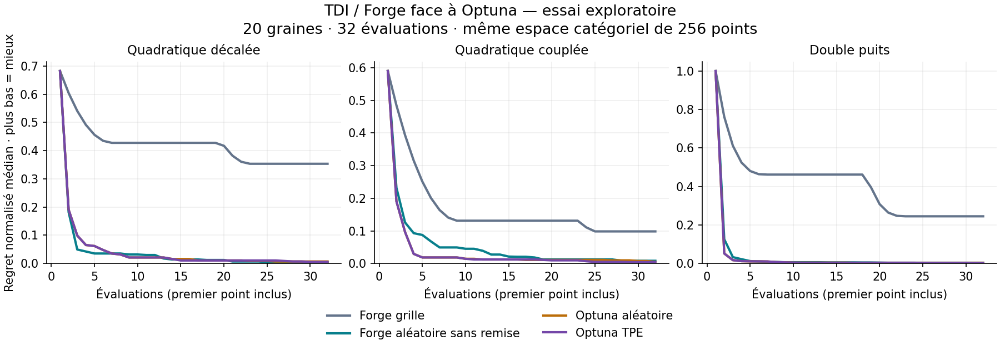

# Optuna comparison: exploratory observations — 2026-09-18

Actual Forge release binary versus Optuna 5.0.0, using the public finite-domain protocol in [the guide](../optuna-comparison.md).

Completed 240 task/seed/arm runs and 7680 objective evaluations. No runs were dropped. The fixed development profile used 20 seeds and 32 evaluations per arm on each of three public tasks.

## Observed quality

Primary metric: median final best loss minus the finite-grid minimum; lower is better. Each cell summarizes 20 optimizer seeds on one fixed task. These are descriptive medians, not confidence intervals or evidence of general superiority.

| Public task | Forge grid | Forge random without replacement | Optuna random | Optuna TPE |
| --- | ---: | ---: | ---: | ---: |
| shifted-bowl | 100 | 1 | 2 | 1.5 |
| coupled-ridge | 72 | 6 | 3.5 | 3 |
| double-well | 1624 | 24 | 24 | 12 |



Grid order explores only a prefix under this budget. Optuna random samples with replacement; Forge random does not. TPE is categorical here. Those algorithmic differences and the narrow public tasks must be retained when interpreting the table. No timing speedup or universal ranking is claimed.

## Reusable evidence

- Executed published TDI source: `2c185982f1d62cd73b5dcf59c5c0f487b0165c3b`.
- Actual Forge binary SHA-256: `7bb75880021f7bbe8888e1058859dd416fa4956e7a618887f5d40f5d1a0ffdc8`.
- Report identity: `351107ef4847e87f5870a4a18ac9c9001fd064c44e775839cf9ba9bb5bc4a68f`.
- Uncompressed file SHA-256: `d56c0e092dc750eea9500b1d765e1c0f3ced0f816fdb57f70e9d8426256ccf7c`.
- [Complete raw report, gzip JSON](2026-09-18-optuna-development.json.gz): manifest, all trajectories and recomputed summaries.
- Timing fields describe the asymmetric adapter paths, not optimizer-only speed.
- The build uses the declared merged Forge revision; source declarations are not build attestations.
- This run exercises no ML model, Hub worker, GPU, protected/final evaluation or production route.

To independently check the downloaded report from TDI:

```bash
gzip -dk 2026-09-18-optuna-development.json.gz
.venv-optuna/bin/python scripts/tdi_optuna_benchmark.py --verify-report 2026-09-18-optuna-development.json
```
